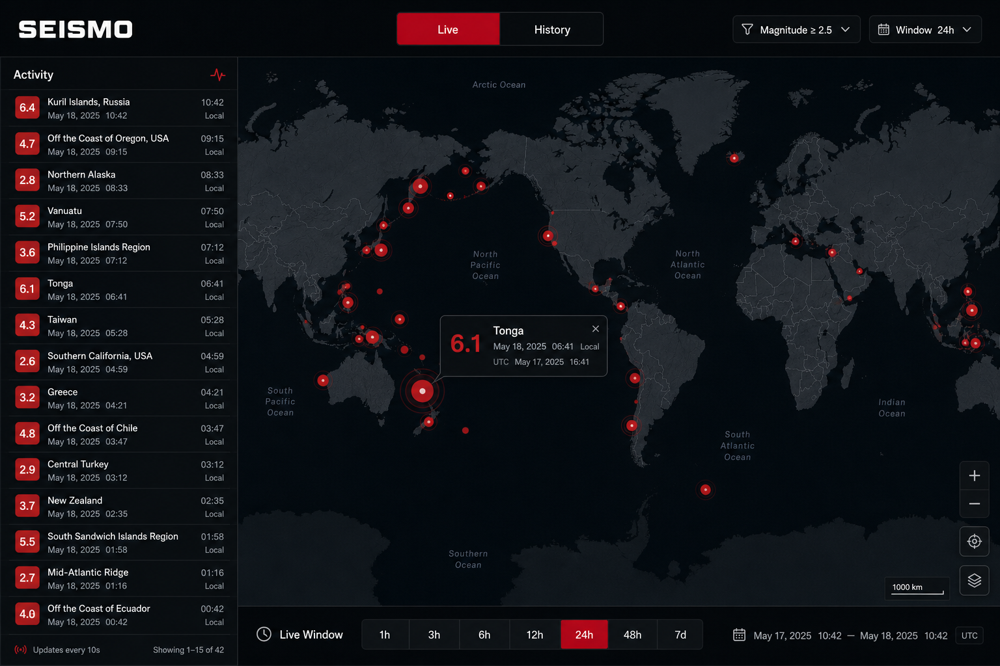

# Seismo

**Self-hosted real-time earthquake monitor** — USGS GeoJSON in, PostGIS + Horizon + Reverb out, dark Livewire map in the browser. No API key, no login, one Docker stack.

Built as a portfolio piece to show an event-driven Laravel app: scheduled ingest, queues, spatial queries, and WebSockets — not another CRUD todo list.



**Status:** v1.3 (Live / History monitor, alert chrome, CSV & GeoJSON exports)

---

## Features

- **Live map** — USGS events on a dark Leaflet basemap; markers scale with magnitude; ripples over WebSockets for M≥2.5
- **Activity feed** — paginated sidebar (15/page) with local time primary, UTC secondary
- **Live window presets** — 1h · 3h · 6h · 12h · 24h · 48h · 7d (default 24h)
- **History mode** — same shell, drag-only time scrubber over stored events
- **Filters** — magnitude, depth, radius, tsunami flag, place search
- **Alerts polish** — stronger treatment for M≥5.0 and tsunami-flagged events; optional sound (off by default)
- **Exports** — bounded CSV / GeoJSON of the current filtered set (rate-limited)
- **First-boot backfill** — ~30 days from USGS `all_month`, then `all_hour` every 60s via Horizon

---

## Tech stack

| Layer | Choice |
|-------|--------|
| App | Laravel 12 · PHP 8.4 · Livewire · Alpine.js |
| Data | PostgreSQL 16 + PostGIS · Redis |
| Realtime | Laravel Reverb (public `earthquakes` channel) |
| Jobs | Laravel Horizon (ingest + backfill) |
| Map | Leaflet · CartoDB Dark tiles |
| Quality | Pest · Pint · Larastan 5 · GitHub Actions |
| Source | [USGS GeoJSON summary feeds](https://earthquake.usgs.gov/earthquakes/feed/v1.0/geojson.php) (no key) |

---

## Quick start

**Prerequisite:** [Docker Desktop](https://www.docker.com/products/docker-desktop/) running. No local PHP, Composer, or Node required.

### Windows (PowerShell)

```powershell
git clone <repo-url> seismo
cd seismo
.\setup.ps1
```

Then open [http://localhost](http://localhost). Horizon (local only): [http://localhost/horizon](http://localhost/horizon).

Day-to-day:

```powershell
.\sail.ps1 up -d    # start
.\sail.ps1 down     # stop
.\sail.ps1 pest     # tests
```

> Do **not** run `.\vendor\bin\sail` directly on Windows — it is a bash script. Use `.\sail.ps1` (or `sail.bat` from Command Prompt).

### macOS / Linux / WSL

```bash
git clone <repo-url> seismo
cd seismo
chmod +x setup.sh
./setup.sh
```

Then open [http://localhost](http://localhost).

```bash
./vendor/bin/sail up -d
./vendor/bin/sail down
./vendor/bin/sail pest
```

### What setup does

1. Copies `.env.example` → `.env` if needed  
2. `composer install` via the official Sail Composer image  
3. `docker compose up -d` (web, Horizon, scheduler, Reverb, PostGIS, Redis)  
4. `artisan key:generate` + `migrate`  
5. `npm install` + `npm run build` inside the app container  

First boot also starts a USGS backfill in the background — the map may be empty for a minute or two until events land.

Default host ports (change in `.env` if taken): app `80`, Vite `5173`, Reverb `8081`, Postgres `5433`, Redis `6380`.

---

## Architecture

USGS feeds are scheduled into Horizon jobs, upserted into PostGIS (idempotent by USGS id), and — for new or materially changed **M≥2.5** events — broadcast over Reverb to the public UI.


```text
  USGS GeoJSON                 Docker / Laravel Sail
  (all_month / all_hour)              │
           │                    ┌─────┴──────┐
           └──────────────────► │ Scheduler  │
                                └─────┬──────┘
                                      ▼
                                ┌────────────┐     ┌─────────────────────┐
                                │  Horizon   │────►│ PostgreSQL + PostGIS│
                                │  workers   │     └──────────┬──────────┘
                                └─────┬──────┘                │
                                      │                       │ queries
                                      ▼                       ▼
                                ┌────────────┐     ┌─────────────────────┐
                                │   Redis    │     │ Public browser UI   │
                                └─────┬──────┘     │ Livewire + Leaflet  │
                                      │            └──────────▲──────────┘
                                      ▼                       │
                                ┌────────────┐                │
                                │   Reverb   │────────────────┘
                                │  (WS)      │   M≥2.5 events
                                └────────────┘
```

| Path | Behavior |
|------|----------|
| First boot | `all_month` backfill (~30 days); auto-retry until complete |
| Steady state | `all_hour` every 60s; store all magnitudes |
| Live UI | Query selected window (default 24h); ripples + Activity for M≥2.5 |
| History UI | Same shell; bottom time scrubber (drag only) |

Deeper write-up: [docs/ARCHITECTURE.md](./docs/ARCHITECTURE.md).

### Failure modes (short)

| Failure | Behavior |
|---------|----------|
| USGS timeout / 5xx | Logged; next poll retries |
| Bad GeoJSON row | Skipped; batch continues |
| Redis down | Queues stall; HTTP can still read PostGIS |
| Reverb down | Map/Activity from DB; live ripples pause |

---

## Exports

From the Magnitude filter panel: **Export CSV** / **Export GeoJSON** for the current Live window or History slice.

```text
GET /export/csv?min_magnitude=2.5&occurred_from=...&occurred_to=...
GET /export/geojson?min_magnitude=2.5&occurred_from=...&occurred_to=...
```

`occurred_from` and `occurred_to` are required. Caps: `SEISMO_EXPORT_MAX_ROWS` (default 5000), `SEISMO_EXPORT_RATE_PER_MINUTE` (default 10). Truncated responses include `X-Seismo-Export-Truncated: 1`.

---

## Development

```powershell
# Windows
.\sail.ps1 pest
.\sail.ps1 pint
.\sail.ps1 composer analyse
.\sail.ps1 npm run dev
```

```bash
# macOS / Linux / WSL
./vendor/bin/sail pest
./vendor/bin/sail pint
./vendor/bin/sail composer analyse
./vendor/bin/sail npm run dev
```

CI runs Pint, Larastan level 5, and Pest against PostGIS on every push/PR.

**Broadcast smoke test:** with the app up and assets built, open two browser tabs on `/`, then run `.\sail.ps1 artisan seismo:broadcast-test` (or `./vendor/bin/sail artisan seismo:broadcast-test`). Both consoles should log `[Seismo] EarthquakeDetected`.

---

## Documentation

| Doc | Purpose |
|-----|---------|
| [docs/IDEA.md](./docs/IDEA.md) | Product intent & locked decisions |
| [docs/ARCHITECTURE.md](./docs/ARCHITECTURE.md) | Containers, ingest, schema, CI |
| [docs/UI.md](./docs/UI.md) | Desktop UI spec (matches mockup) |
| [docs/SPRINT.md](./docs/SPRINT.md) | Sprint plan 0–9 + as-built notes |
| [docs/mockups/](./docs/mockups/) | Live mockup + architecture diagram |

---

## License

MIT © Micha Schiess
