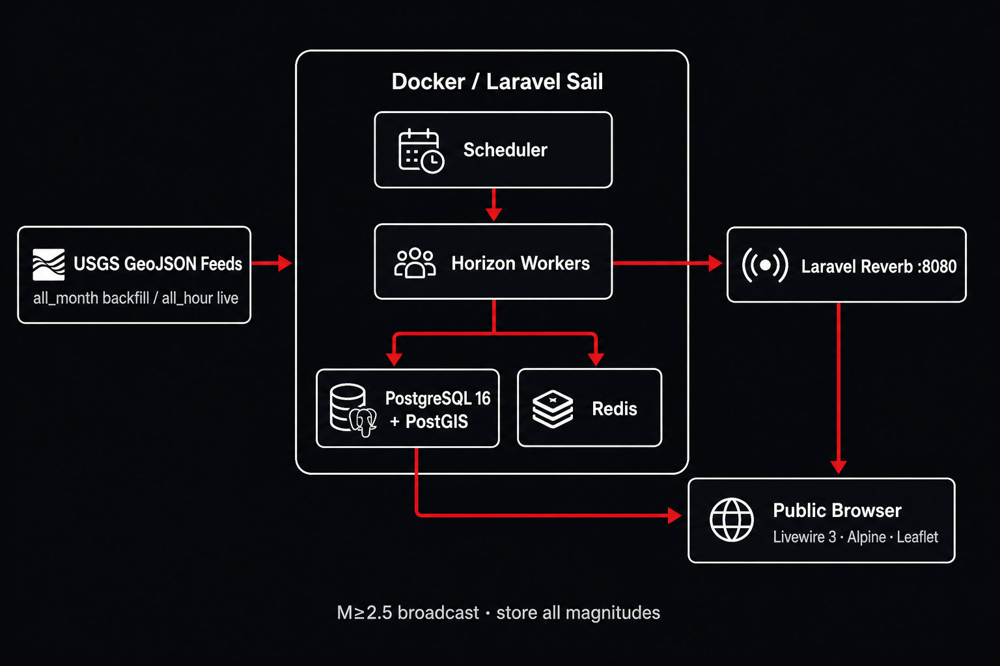

# Seismo

Self-hosted real-time seismic monitoring: USGS GeoJSON → PostgreSQL/PostGIS → Laravel Horizon → Reverb WebSockets → public Livewire + Leaflet map.

> **Status:** **v1.2** — v1.0 Live/History monitor plus alert polish (M≥5.0 emphasis, tsunami banner, optional sound). See [docs/SPRINT-8.md](./docs/SPRINT-8.md).

---

## Docs

| Doc | Purpose |
|-----|---------|
| [docs/IDEA.md](./docs/IDEA.md) | Product intent, locked decisions, roadmap |
| [docs/ARCHITECTURE.md](./docs/ARCHITECTURE.md) | Containers, ingest/backfill, schema, CI |
| [docs/UI.md](./docs/UI.md) | **Desktop UI spec** (must match mockup) |
| [docs/SPRINT.md](./docs/SPRINT.md) | Sprint plan (0–9) with exit criteria |
| [docs/SPRINT-1.md](./docs/SPRINT-1.md) | Sprint 1 as-built — PostGIS + `Earthquake` |
| [docs/SPRINT-2.md](./docs/SPRINT-2.md) | Sprint 2 as-built — USGS ingest & backfill |
| [docs/SPRINT-3.md](./docs/SPRINT-3.md) | Sprint 3 as-built — Reverb broadcasts |
| [docs/SPRINT-4.md](./docs/SPRINT-4.md) | Sprint 4 as-built — Live UI shell |
| [docs/SPRINT-5.md](./docs/SPRINT-5.md) | Sprint 5 as-built — Live interactivity |
| [docs/SPRINT-6.md](./docs/SPRINT-6.md) | Sprint 6 as-built — History mode |
| [docs/SPRINT-7.md](./docs/SPRINT-7.md) | Sprint 7 as-built — Hardening & v1.0 freeze |
| [docs/SPRINT-8.md](./docs/SPRINT-8.md) | Sprint 8 as-built — Alerts polish (v1.2) |
| [docs/mockups/seismo-desktop-mockup.png](./docs/mockups/seismo-desktop-mockup.png) | Canonical Live desktop mockup |
| [docs/mockups/seismo-architecture.png](./docs/mockups/seismo-architecture.png) | Architecture flowchart graphic |

---

## What it does

1. **Backfill** on first boot (auto-retries): USGS `all_month` (~30 days) + `raw` jsonb.
2. **Live ingest** every 60s: USGS `all_hour` via Horizon (store all magnitudes).
3. **Public Live desktop** as in the mockup: SEISMO header, Live/History pill, Activity sidebar (15/page), dark map, Live Window presets `1h…7d` (default 24h).
4. Ripples / Activity pushes for **M≥2.5**; markers scale red/size with magnitude; popup = Local + small UTC.
5. **History:** same shell, bottom time scrubber (drag only).

---

## Tech stack

| Layer | Technology | Role |
|-------|------------|------|
| Runtime | PHP 8.4 (Sail), Docker / Laravel Sail | Local multi-container app (web, Horizon, scheduler, Reverb) |
| Backend | Laravel 12 | HTTP, scheduling, jobs, broadcasting, i18n (`en`) |
| Queues | Redis + Laravel Horizon | Ingest / backfill workers from day one |
| Database | PostgreSQL 16 + PostGIS | Events + `geography(Point, 4326)` spatial queries |
| Realtime | Laravel Reverb + Redis | Public WebSocket channel `earthquakes` |
| Frontend | Livewire, Alpine.js, Leaflet | Public Live/History UI (dark + red); no SPA framework |
| Map tiles | CartoDB Dark (or equivalent) | Basemap under epicenter markers |
| Quality | Pest, Pint, Larastan 5 | GitHub Actions CI in v1 |
| Data source | USGS GeoJSON summary feeds | `all_month` backfill · `all_hour` live poll (no API key) |

Details: [docs/ARCHITECTURE.md](./docs/ARCHITECTURE.md).

> **Note:** Sprint docs originally targeted Laravel 11; the scaffold uses **Laravel 12** because Laravel 11 is past security EOL and Composer blocks every 11.x install.

---

## Architecture (summary)

USGS feeds are pulled on a schedule into Horizon jobs, upserted into PostGIS (idempotent by USGS id), and — for new or materially changed **M≥2.5** events — broadcast over Reverb to the public browser UI.



```text
  USGS GeoJSON                 Docker / Laravel Sail
  (all_month / all_hour)              │
           │                    ┌─────┴──────┐
           └──────────────────► │ Scheduler  │
                                └─────┬──────┘
                                      ▼
                                ┌────────────┐     ┌─────────────────────┐
                                │  Horizon   │────►│ PostgreSQL + PostGIS│
                                │  workers   │     └──────────┬──────────┘
                                └─────┬──────┘                │
                                      │                       │ queries
                                      ▼                       ▼
                                ┌────────────┐     ┌─────────────────────┐
                                │   Redis    │     │ Public browser UI   │
                                └─────┬──────┘     │ Livewire + Leaflet  │
                                      │            └──────────▲──────────┘
                                      ▼                       │
                                ┌────────────┐                │
                                │   Reverb   │────────────────┘
                                │  (WS :8080)│   M≥2.5 events
                                └────────────┘
```

| Path | Behavior |
|------|----------|
| First boot | `all_month` backfill (~30 days), auto-retry until complete; no WS storm |
| Steady state | `all_hour` every 60s; store all magnitudes |
| Live UI | Query last window (default 24h); ripples + Activity for M≥2.5 |
| History UI | Same shell; bottom time scrubber (drag only) |

Full write-up: [docs/ARCHITECTURE.md](./docs/ARCHITECTURE.md).

---

## Quick start (Sail only)

Prerequisites: [Docker Desktop](https://www.docker.com/products/docker-desktop/). Local PHP/Composer are optional — Sail runs the app.

```bash
cp .env.example .env
docker run --rm -u "$(id -u):$(id -g)" -v "$(pwd):/var/www/html" -w /var/www/html laravelsail/php84-composer:latest composer install --ignore-platform-req=ext-pcntl
./vendor/bin/sail up -d
./vendor/bin/sail artisan key:generate
./vendor/bin/sail artisan migrate
```

On Windows (PowerShell), after `composer install` via Docker as above:

> **Do not run `.\vendor\bin\sail` directly** — it is a bash script and Windows will prompt “Choose an app to open sail”. Use the project wrapper instead:

```powershell
cp .env.example .env
.\sail.ps1 up -d
.\sail.ps1 artisan key:generate
.\sail.ps1 artisan migrate
```

(`sail.bat` works the same from Command Prompt: `sail.bat up -d`.)

Laravel Sail officially targets WSL2 on Windows; `sail.ps1` forwards to `docker compose` for native PowerShell. Alternatively, install [WSL2](https://learn.microsoft.com/en-us/windows/wsl/install) and run `./vendor/bin/sail` from an Ubuntu terminal.

Supervisor inside the app container starts **web**, **Horizon**, **`schedule:work`**, and **Reverb** (container `:8080`, host `${REVERB_SERVER_PORT}`).

Open `http://localhost` — you should see the Live monitor (SEISMO header, Activity sidebar, dark map). Horizon (local only): `http://localhost/horizon`.

Default host port forwards (change in `.env` if occupied): app `80`, Vite `5173`, Reverb `8081`, Postgres `5433`, Redis `6380`.

### Broadcast smoke (Sprint 3)

1. Ensure assets are built (`npm run build` or `.\sail.ps1 npm run build`) so Echo loads on the placeholder.
2. Open `http://localhost` in two browser tabs with DevTools console open.
3. Run `.\sail.ps1 artisan seismo:broadcast-test` (or `./vendor/bin/sail artisan seismo:broadcast-test` in WSL).
4. Both tabs should log `[Seismo] EarthquakeDetected` with the same payload.

Reverb listens in-container on `:8080` and is forwarded to host `${REVERB_SERVER_PORT}` (default `8081`).

UI acceptance: [docs/UI.md](./docs/UI.md) checklists (Live + History complete).

### Tests & quality

```powershell
.\sail.ps1 pest
.\sail.ps1 pint
.\sail.ps1 composer analyse
```

CI runs Pint, Larastan level 5, and Pest against PostGIS on every push/PR.

### Failure modes

The app degrades gracefully when dependencies fail (full detail: [ARCHITECTURE.md §10](./docs/ARCHITECTURE.md)):

| Failure | Behavior |
|---------|----------|
| USGS timeout / 5xx | Logged; ingest job soft-fails; next scheduled poll retries |
| Malformed GeoJSON row | Skipped; batch continues |
| Redis down | Horizon queues stall; public HTTP may still read PostGIS |
| Reverb down | Map and Activity show DB state; live ripples pause until reconnect |
| Partial backfill | Completion marker stays unset; auto-retry on next boot/tick |

Horizon dashboard (`/horizon`) is available in **`local` environment only**.

---

## Locked decisions (summary)

| Topic | Choice |
|-------|--------|
| Name / license | Seismo · MIT © Micha Schiess |
| UI | Match [docs/UI.md](./docs/UI.md) + mockup |
| Live presets | 1h 3h 6h 12h 24h 48h 7d (default 24h) |
| Activity | 15/page; `Updates every 10s`; `Showing x–y of z` |
| Default filter | Magnitude ≥ 2.5 |
| Marker / list | Popup-only on marker; row click pans + popup |
| Accent | ≈ `#E31A22` on dark charcoal |
| Data / queues | USGS only, `raw` jsonb, Horizon, Sail local, CI in v1 |

---

## License

MIT © Micha Schiess
